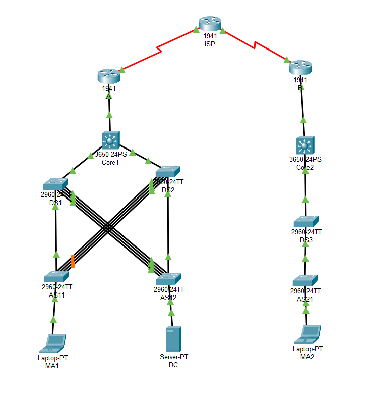

# **DNET2** - _Lab 2_

# Addressplan

## Overview

| Usergroup /IPNet | VLAN   | IP           | Subnet        |
| ---------------- | ------ | ------------ | ------------- |
| **Standort A**   |        |              |               |
| Mitarbeiter      | Vlan10 | 172.168.10.0 | 255.255.255.0 |
| Server           | Vlan20 | 172.168.20.0 | 255.255.255.0 |
| Administratoren  | Vlan30 | 172.168.30.0 | 255.255.255.0 |
| **Standort B**   |        |              |               |
| Mitarbeiter      | Vlan10 | 172.169.10.0 | 255.255.255.0 |
| Server           | Vlan20 | 172.169.20.0 | 255.255.255.0 |
| Administratoren  | Vlan30 | 172.169.30.0 | 255.255.255.0 |

### Devices

| Device | Port/VLAN | IP            | Subnet          |
| ------ | --------- | ------------- | --------------- |
| ISP    | S0/0/0    | 192.168.0.1   | 255.255.255.252 |
| ISP    | S0/0/1    | 192.168.1.1   | 255.255.255.252 |
| A      | S0/0/0    | 192.168.0.2   | 255.255.255.252 |
| A      | G0/0      | 192.168.2.1   | 255.255.255.252 |
| B      | S0/0/0    | 192.168.1.2   | 255.255.255.252 |
| B      | G0/0      | 192.168.3.1   | 255.255.255.252 |
| Core1  | Gig1/0/1  | 192.168.2.2   | 255.255.255.252 |
| Core1  | VLAN10    | 172.168.10.1  | 255.255.255.0   |
| Core1  | VLAN20    | 172.168.20.1  | 255.255.255.0   |
| Core1  | VLAN30    | 172.168.30.1  | 255.255.255.0   |
| Core1  | VLAN30    | 172.168.30.1  | 255.255.255.0   |
| DS1    | VLAN30    | 172.168.30.9  | 255.255.255.0   |
| DS2    | VLAN30    | 172.168.30.10 | 255.255.255.0   |
| AS11   | VLAN30    | 172.168.30.11 | 255.255.255.0   |
| AS12   | VLAN30    | 172.168.30.12 | 255.255.255.0   |
| Core2  | Gig1/0/1  | 192.168.3.2   | 255.255.255.252 |
| Core2  | VLAN10    | 172.169.10.1  | 255.255.255.0   |
| Core2  | VLAN20    | 172.169.20.1  | 255.255.255.0   |
| Core2  | VLAN30    | 172.169.30.1  | 255.255.255.0   |
| DS3    | VLAN30    | 172.169.30.9  | 255.255.255.0   |
| AS12   | VLAN30    | 172.168.30.21 | 255.255.255.0   |

## Belegungsplan Access Switch

| Port  | VLAN | Mode   |
| ----- | ---- | ------ |
| F0/1  | 99   | Trunk  |
| F0/2  | 99   | Trunk  |
| F0/3  | 99   | Trunk  |
| F0/4  | 99   | Trunk  |
| F0/5  | 20   | Access |
| F0/6  | 20   | Access |
| F0/7  | 20   | Access |
| F0/8  | 20   | Access |
| F0/9  | 10   | Access |
| F0/10 | 10   | Access |
| F0/12 | 10   | Access |
| F0/13 | 10   | Access |
| F0/14 | 10   | Access |
| F0/15 | 10   | Access |
| F0/16 | 10   | Access |
| F0/17 | 10   | Access |
| F0/18 | 10   | Access |
| F0/19 | 10   | Access |
| F0/20 | 10   | Access |
| F0/21 | 10   | Access |
| F0/22 | 10   | Access |
| F0/23 | 30   | Access |
| F0/24 | 30   | Access |
| G/24  | 99   | Trunk  |
| G/24  | 99   | Trunk  |

# VTP

| Type     |                            |
| -------- | -------------------------- |
| Servers  | DS1,DS2,DS3                |
| Clients  | AS11,AS12,AS21,Core1,Core2 |
| Domain   | dnet2                      |
| Password | 2                          |

# Device Configuration

## ISP

| Port   | Remote | Remote Port |
| ------ | ------ | ----------- |
| S0/0/0 | A      | S0/0/0      |
| S0/0/1 | B      | S0/0/0      |

## A

| Port   | Remote | Remote Port |
| ------ | ------ | ----------- |
| S0/0/0 | ISP    | S0/0/0      |
| Gig0/0 | Core1  | Gig1/0/1    |

## Core1

| Port      | Remote | Remote Port |
| --------- | ------ | ----------- |
| Gig0/0    | A      | Gig1/0/1    |
| Gig1/0/23 | DS2    | Gig0/1      |
| Gig1/0/24 | DS1    | Gig0/1      |

## DS1

| Port   | Remote | Remote Port |
| ------ | ------ | ----------- |
| Gig0/1 | Core1  | Gig1/0/1    |
| Gig0/2 | AS12   | Gig0/1      |
| Fa0/21 | AS11   | Fa0/4       |
| Fa0/22 | AS11   | Fa0/3       |
| Fa0/23 | AS11   | Fa0/2       |
| Fa0/24 | AS11   | Fa0/1       |

## DS2

| Port   | Remote | Remote Port |
| ------ | ------ | ----------- |
| Gig0/1 | Core1  | Gig1/0/1    |
| Gig0/2 | AS11   | Gig0/1      |
| Fa0/21 | AS12   | Fa0/4       |
| Fa0/22 | AS12   | Fa0/3       |
| Fa0/23 | AS12   | Fa0/2       |
| Fa0/24 | AS12   | Fa0/1       |

## AS11

| Port   | Remote | Remote Port |
| ------ | ------ | ----------- |
| Gig0/1 | DS1    | Gig1/0/1    |
| Fa0/9  | MA1    |             |
| Fa0/4  | DS2    | Fa0/21      |
| Fa0/3  | DS2    | Fa0/22      |
| Fa0/2  | DS2    | Fa0/23      |
| Fa0/1  | DS2    | Fa0/24      |

## AS12

| Port   | Remote | Remote Port |
| ------ | ------ | ----------- |
| Gig0/1 | DS2    | Gig1/0/1    |
| Fa0/5  | DC     |             |
| Fa0/4  | DS1    | Fa0/21      |
| Fa0/3  | DS1    | Fa0/22      |
| Fa0/2  | DS1    | Fa0/23      |
| Fa0/1  | DS1    | Fa0/24      |

## B

| Port   | Remote | Remote Port |
| ------ | ------ | ----------- |
| S0/0/0 | ISP    | S0/0/1      |
| Gig0/0 | Core2  | Gig1/0/1    |

## Core2

| Port      | Remote | Remote Port |
| --------- | ------ | ----------- |
| Gig0/0    | B      | Gig1/0/1    |
| Gig1/0/23 | DS3    | Gig0/1      |

## DS2

| Port   | Remote | Remote Port |
| ------ | ------ | ----------- |
| Gig0/1 | Core1  | Gig1/0/1    |
| Gig0/2 | AS21   | Gig0/1      |

## AS11

| Port   | Remote | Remote Port |
| ------ | ------ | ----------- |
| Gig0/1 | DS3    | Gig1/0/1    |
| Fa0/9  | MA1    |             |
